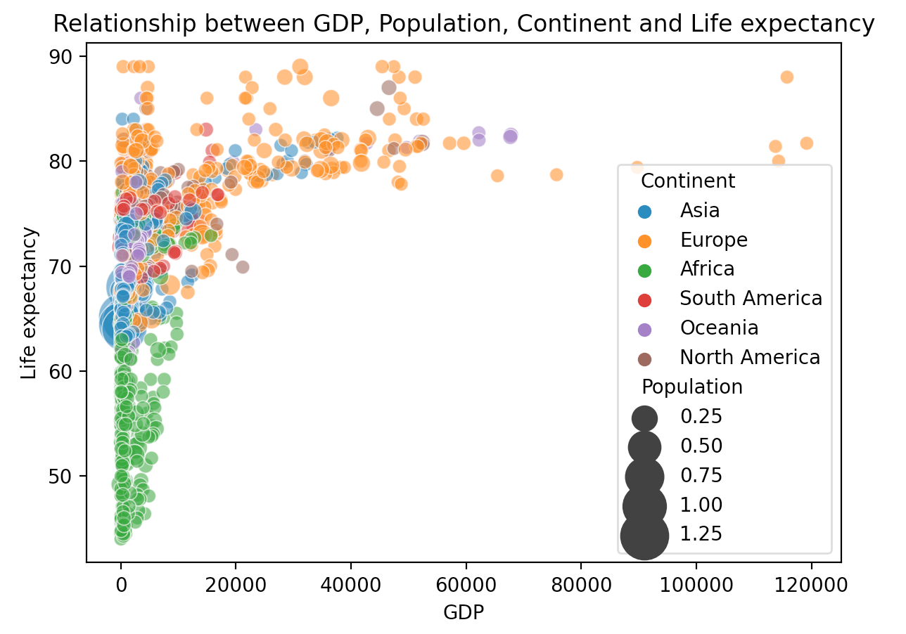
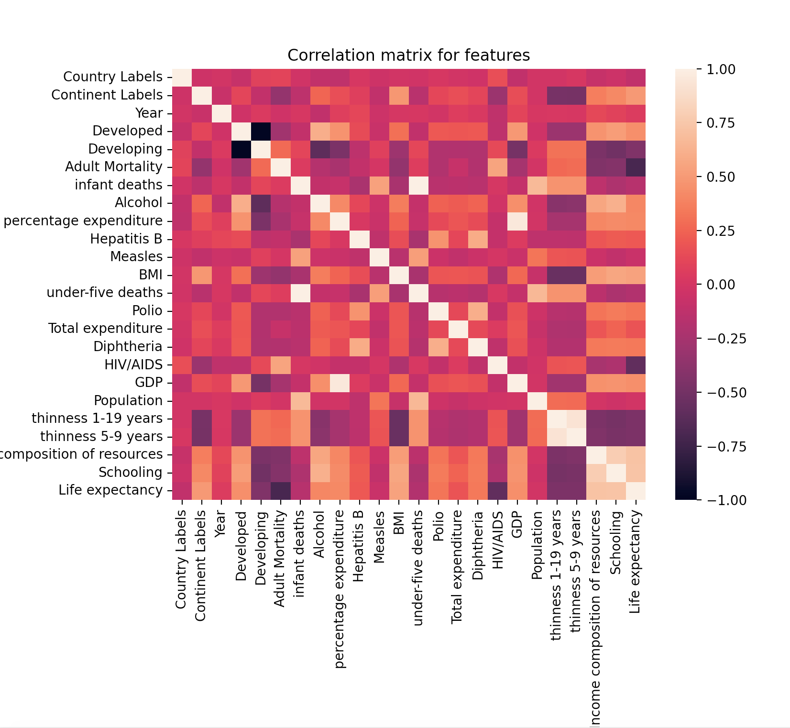

<!-- TABLE OF CONTENTS -->

  
Table of Contents

  <ol>
    <li>
      <a href="#about-the-project">About The Project</a>
    </li>
    <li>
      <a href="#contents">Contents</a>
      <ul>
        <li><a href="#project-1">Project 1</a></li>
        <li><a href="#project-2">Project 2</a></li>
        <li><a href="#project-3">Project 3</a></li>
      </ul>
    </li>
    <li><a href="#screenshots">Screenshots</a></li>
    <li><a href="#built-with">Built With</a></li>
      <ul>
          <li><a href="#installation">Installation</a></li>
      </ul>
    <li><a href="#author">Author</a></li>
    <li><a href="#license">License</a></li>
  </ol>

## About The Project

In this project, I use the [Life Expectancy dataset from WHO](https://www.kaggle.com/kumarajarshi/life-expectancy-who) to analyze the health factor related to the life expectancy and predict life expectancy. The observations of this dataset are based on different countries from a period of years between 2000 and 2015 and feature consist of several aspects of factors that may influence the life expectancy of the population. We aim to predict the numeric life expectancy of each country which could be converted into a regression problem based on different supervised learning algorithms and feature preprocessing techniques. Also we implement different semi-supervised regression learning algorithms for the sake of dealing with label-expensive real world problems <!--引用算法和论文-->. Then, the last part is Transfer learning which we use to learn the knowledge from the developing countries and use them to help predict the developing countries.

By analyzing this dataset, we could figure out which factors may significantly contribute to life expectancy and the analysis result could give suggestions to those countries and help improve life expectancy, which makes the project essentially important and meaningful.

## Contents
There are four main parts. 

- Analyzing the factors that may have impact on the life expectancy based on feature correlation and feature importance. implementing different data washing, data handling, data preprocessing, and feature engineer methods.

- The second main part, I apply 7 advanced Supervised regression models, Lasso, Ridge, CART, Random Forest, AdaBoost, SVR, and KNN, on the dataset and do the performance comparison based on MSE and R^2 score. I do the model selection techniques to improve the performance and make the prediction feasible and reasonable.
- The third part: extension part 1, I implement Semi-Supervised Learning algorithm to deal with the real-world problem include unlabeled data. I use Co-training regression and Label Propagation regression to do the performance comparison with the baseline KNN algorithm. We could see the unlabeled data help improve the labeled data performance in an SSL model. 
- The last part: extension part 2, I implement Transfer Learning to the dataset by dividing the whole dataset based on ‘Status’ into developed country dataset (target domain) and developing country dataset (source domain). I use the Two-stage TrAdaBoost.R2 to do the comparison with Baseline AdaBoost model. For supervised learning part I use Cross-Validation to do the model selection; and in data preprocessing, extension SSL and extension TL part, I use validation to do the model selection. The final performances between Supervised Learning models are Support Vector Regression > Random Forest > AdaBoost > K-Nearest Neighbors > Ridge > Lasso > CART > non-trivial (Linear Regression) > Trivial (Mean). For the performances of the Semi-Supervised Learning model are Label Propagation > Co-training > Baseline KNN. For the performances of the Transfer Learning model are Two-stage TrAdaBoost.R2 > Baseline AdaBoost

## Screenshots
 

  
  

## Built With
- [Python 3.7.4](https://www.python.org/downloads/release/python-374/)

### Installation
This code built and tested with Python 3.7.4, included package scikit-learn 1.0.1, pandas 1.3.4, numpy 1.21.4, scipy 1.7.2, matplotlib 3.4.3, and seaborn 0.11.2.

## further improvement

## Author

**Shuai Xu** | University of Southern California

[Profile](https://github.com/sxu75374) - <a href="mailto:sxu75374@usc.edu?subject=Nice to meet you!&body=Hi Shuai!">Email</a>

Project Link: [https://github.com/sxu75374/LifeExpectancyPrediction](https://github.com/sxu75374/LifeExpectancyPrediction)

<!-- LICENSE -->
## License

Distributed under the MIT License. See `LICENSE.md` for more information.

[<a href="#top">back to top</a>]

